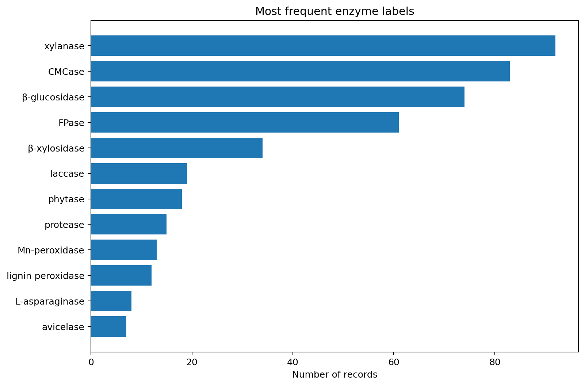
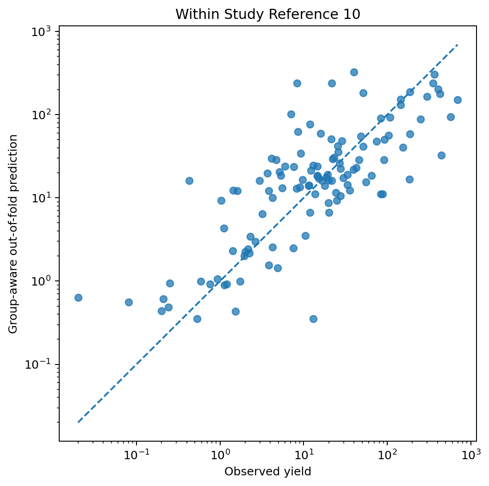
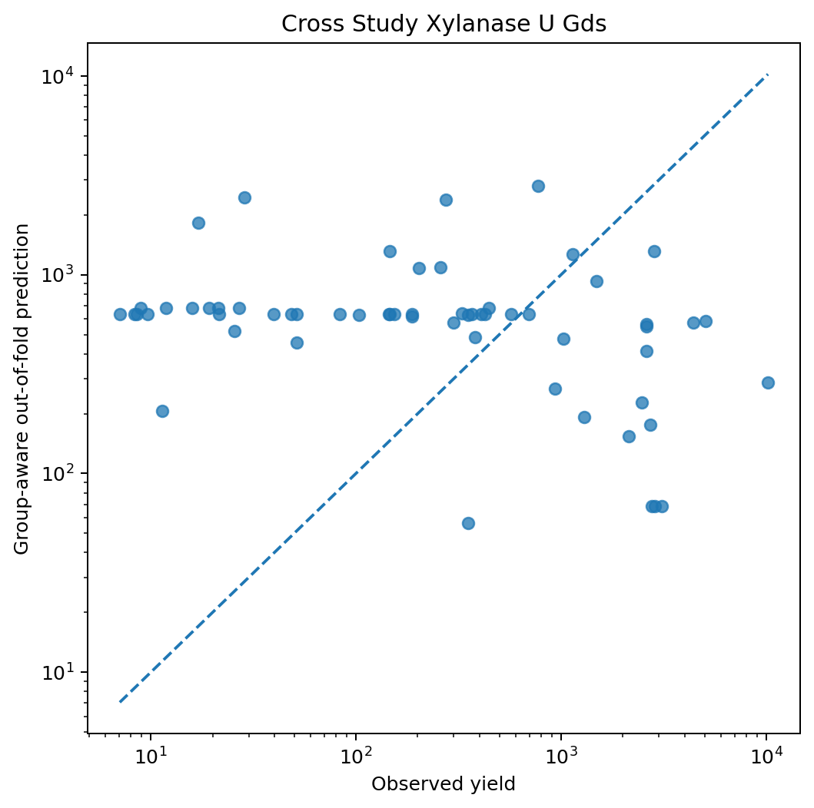

# AI-Assisted Optimisation of Enzyme Production from Cereal Food Residues

[](https://www.python.org/)
[](LICENSE)
[](LICENSE_DATA.md)
[](https://doi.org/10.17632/k2xv3yss8m.2)
[](#project-status)

## FAIR-Aligned, Uncertainty-Aware Machine Learning for Circular Enzyme Production via Solid-State Fermentation

> **Research question:**  
> Can FAIR-aligned machine-learning models predict enzyme production from cereal food residues and identify promising solid-state fermentation conditions for circular bioprocessing?

FAIR-SSF-Opt is a research-oriented machine-learning prototype for studying enzyme production from cereal residues, food-waste-derived substrates, and agro-industrial side streams through fungal solid-state fermentation.

The repository demonstrates an end-to-end workflow that begins with a real literature-derived Excel database and continues through data preservation, data cleaning, FAIR-oriented documentation, cohort construction, feature engineering, leakage-aware validation, model comparison, uncertainty estimation, result reporting, and an interactive Streamlit dashboard.

The project was designed as a portfolio prototype for research at the intersection of:

- artificial intelligence and machine learning;
- FAIR research data management;
- circular food production;
- food and bioprocess systems;
- solid-state fermentation;
- agricultural and food-waste valorisation;
- uncertainty-aware modelling;
- process-data harmonisation;
- scientific reproducibility;
- decision-support and future process optimisation.

The main scientific lesson of the prototype is not simply that a Random Forest can be trained. The more important finding is that model quality depends strongly on how experimental data are structured, documented, grouped, and validated. A model may appear accurate when records from the same experiment or scientific article are split randomly between training and test sets. FAIR-SSF-Opt therefore uses group-aware validation to test whether the model transfers to unseen experiments and unseen scientific articles.

---

## FAIR-Aligned AI Benchmarking for Circular Enzyme Production from Cereal Residues

FAIR-SSF-Opt is a research-oriented prototype that combines **FAIR data
management**, **solid-state fermentation**, **machine learning**,
**group-aware validation**, and **uncertainty estimation**.

The project uses a real literature-derived dataset on fungal enzyme production
from cereal and mixed agro-industrial residues. It is designed as a portfolio
prototype for research on AI, digitalisation, circular food production, and
food/bioprocess data systems.

> **Status:** Functional research prototype. The included pipeline has been
> tested on the supplied dataset.

> **Important:** The results are not validated industrial process
> recommendations. This repository demonstrates a data and modelling workflow.

---

## Why this project matters

Circular food and bioprocess projects need to combine data from different
partners, laboratories, publications, substrates, organisms, units, and
process protocols. A model can appear accurate if data from the same
experiment or article leak into both training and test sets.

FAIR-SSF-Opt therefore asks two linked questions:

1. **Within-study modelability:** Can a relatively standardised experimental
   table support prediction when all outputs from the same experiment remain
   in one validation fold?
2. **Cross-study transportability:** Can a model predict xylanase activity for
   scientific articles that were completely excluded from training?

The second question is particularly relevant to an international consortium:
a reusable model must transfer across data providers, not merely memorise one
laboratory or article.

---

## Source dataset

**Production of enzymes via solid state fermentation from cereals — Version 2**  
Authors: Joseph Bourgine, Dominika Teigiserova, Marianne Thomsen  
DOI: `10.17632/k2xv3yss8m.2`  
Licence: **CC BY 4.0**

The supplied workbook contains:

| Property | Observed value |
|---|---:|
| Enzyme-output records | 487 |
| Numeric yield records | 485 |
| Experiments | 209 |
| Scientific references | 69 |
| Substrate labels | 45 |
| Organism/co-culture labels | 111 |
| Enzyme labels | 34 |
| Activity units | 6 |
| Publication period | 2010–2019 |

The dataset includes substrate, fungal organism, enzyme, yield, activity unit,
incubation time, pretreatment, supplements, optimisation methods, process
parameters, notes, year, and article reference.

The most common enzyme-unit cohorts include:

- xylanase in U/gds: 60 records;
- CMCase in U/gds: 60 records;
- beta-glucosidase in U/gds: 51 records;
- FPase in U/gds: 35 records.

Raw yield values are **not pooled across incompatible enzymes or units**.

---

## Research objectives

### Objective 1 — FAIR-oriented data audit

- preserve the raw scientific fields;
- export machine-readable UTF-8 CSV files;
- document provenance, licence, units, variables, and transformations;
- identify missing, nonnumeric, and heterogeneous values;
- quantify comparable enzyme-unit cohorts.

### Objective 2 — Within-study multi-enzyme benchmark

The first model uses **Reference 10**, which contains a structured screening
study with multiple enzyme outputs.

- numeric records: 119;
- experiments: 30;
- validation group: experiment ID;
- target: reported enzyme activity;
- models: dummy median, random forest, extra trees.

All enzyme outputs from one experiment remain in the same fold. This prevents
the model from seeing identical substrate/organism/process conditions during
training and testing.

### Objective 3 — Cross-study xylanase benchmark

The second model uses only:

- enzyme: xylanase;
- unit: U/gds;
- records: 60;
- references: 16;
- validation group: complete article reference.

Holding out entire articles tests transportability to unseen data sources.

### Objective 4 — Uncertainty-aware prediction

The selected model is refitted through group bootstrap sampling. The dashboard
reports a point prediction and the 5th–95th percentile of bootstrap model
predictions.

---

## Scientific hypothesis

A relatively standardised within-study dataset should be more learnable than a
heterogeneous cross-study literature dataset. If cross-study performance is
weak, the result supports the need for:

- common process-data schemas;
- comparable activity units;
- explicit metadata and provenance;
- consistent recording of pH, temperature, moisture, inoculum, and scale;
- missing-data and quality flags;
- uncertainty-aware reporting.

This connects AI model development directly to FAIR digital infrastructure.

---

## Preliminary tested results

A local run of the included code produced the following indicative results.
The pipeline recomputes them on every run.

### Within-study Reference 10 benchmark

The random forest was selected in the preliminary run:

- repeated group-validation median MAE: approximately **41.9**;
- repeated group-validation median absolute error: approximately **10.0**;
- repeated group-validation median R-squared: approximately **0.32**;
- five-fold grouped out-of-fold R-squared: approximately **0.29**.

### Cross-study xylanase benchmark

The cross-study model had negative grouped out-of-fold R-squared. The model did
not reliably generalise to unseen articles.

This result is intentionally reported rather than hidden. It indicates that
article-specific conditions, sparse categorical combinations, inconsistent
metadata, source imbalance, and unreported variables limit transportability.
For CIRC4FOOD, that is a useful design finding: **FAIR data capture and AI
modelling must be developed together**.

---

## Repository structure

```text
fair-ssf-opt/
├── README.md
├── README_FA.md
├── DATASET_CARD.md
├── MODEL_CARD.md
├── INTERVIEW_NOTES.md
├── LICENSE
├── LICENSE_DATA.md
├── CITATION.cff
├── requirements.txt
├── pyproject.toml
├── app.py
├── scripts/
│   └── run_pipeline.py
├── src/
│   └── fair_ssf_opt/
│       ├── __init__.py
│       ├── data.py
│       ├── features.py
│       ├── modeling.py
│       └── reporting.py
├── data/
│   ├── raw/
│   │   ├── source_workbook.xlsx
│   │   ├── ssf_enzyme_production.csv
│   │   ├── references.csv
│   │   └── introduction.csv
│   └── processed/
├── metadata/
│   ├── data_dictionary.csv
│   ├── dataset_description.json
│   └── provenance.yaml
├── artifacts/
├── reports/
│   └── figures/
└── tests/
    └── test_features.py
```


---

## Generated figures

After running the pipeline, the repository contains reproducible figures such as:







The logarithmic axes in the prediction plots make the wide activity range visible.

---

## Installation

Python 3.10 or newer is recommended.

### Clone the repository

```bash
git clone https://github.com/tembooo/fair-ssf-opt.git
cd fair-ssf-opt
```

### Create a virtual environment

Windows:

```bash
python -m venv .venv
.venv\Scripts\activate
```

Linux or macOS:

```bash
python -m venv .venv
source .venv/bin/activate
```

### Install dependencies

```bash
pip install -r requirements.txt
```

Optional editable installation:

```bash
pip install -e .
```

---

## Run the complete pipeline

```bash
python scripts/run_pipeline.py
```

A faster smoke test can use fewer repeated splits and bootstrap models:

```bash
python scripts/run_pipeline.py --splits 5 --bootstrap 5
```

A more stable portfolio run can use:

```bash
python scripts/run_pipeline.py --splits 25 --bootstrap 40
```

The pipeline will:

1. profile the complete dataset;
2. write cohort summaries;
3. create the within-study and cross-study cohorts;
4. compare dummy, random-forest, and extra-trees models;
5. perform group-aware out-of-fold prediction;
6. train group-bootstrap uncertainty models;
7. export feature importance;
8. generate figures;
9. save a machine-readable run summary.

---

## Launch the dashboard

After running the pipeline:

```bash
streamlit run app.py
```

The dashboard provides:

- within-study and cross-study modes;
- model and validation summaries;
- substrate, organism, enzyme, and process inputs;
- point predictions;
- bootstrap prediction intervals;
- a training-cohort browser;
- interpretation of within-study versus cross-study performance.

---

## Run tests

```bash
pytest
```

The tests currently cover decimal-comma process parsing, optimisation-method
classification, and substrate-family extraction.

---

## Modelling details

### Target transformation

The models are trained on:

```text
log(1 + reported enzyme activity)
```

Predictions are converted back to the original activity scale before metrics
are calculated. The transformation reduces the influence of extreme activity
values while preserving non-negative predictions.

### Features

The prototype uses:

- substrate label and cereal family;
- organism label and genus;
- enzyme and activity unit;
- incubation time;
- publication year;
- mixture and co-culture flags;
- conservative pretreatment flags;
- conservative supplement flags;
- optimisation-method category;
- parsed pH, temperature, moisture content, and agitation when available.

The article reference is **not used as a predictive feature**. It is used only
as a validation group.

### Leakage control

- **Within-study:** group by experiment ID.
- **Cross-study:** group by article reference.

This is more conservative than a random row split and is central to the
scientific value of the prototype.

---

## FAIR implementation

### Findable

- stable filenames;
- DOI and source citation;
- dataset and model cards;
- variable-level data dictionary;
- machine-readable run summary.

### Accessible

- source licence documented separately;
- open CSV exports included;
- clear distinction between source data, processed data, and models.

### Interoperable

- UTF-8 CSV, JSON, and YAML;
- explicit unit field;
- documented derived variables;
- preserved reference identifiers.

### Reusable

- reproducible scripts;
- provenance file;
- group-aware validation logic;
- limitations and intended use;
- software and data licences;
- citation metadata.

---

## Limitations

- The dataset is literature-derived and heterogeneous.
- Yield values are not directly comparable across all enzyme-unit groups.
- Process parameters are semi-structured and incompletely reported.
- Reference 10 contributes a large structured block of records.
- Exact strain, scale, analytical assay, and protocol effects may be hidden.
- Tree-based importance is not a causal explanation.
- Bootstrap intervals do not include all experimental uncertainty.
- The dashboard can create combinations that were not experimentally tested.
- All recommendations require domain review and experimental validation.

---

## Recommended next steps

1. define a consortium-wide food/bioprocess metadata schema;
2. add controlled vocabularies for substrates, organisms, enzymes, and units;
3. capture reactor scale, moisture, inoculum, pH, temperature, oxygen transfer,
   and analytical method consistently;
4. connect process outputs to energy, water, waste, and LCA indicators;
5. test hybrid mechanistic–machine-learning models;
6. apply conformal or quantile uncertainty methods;
7. perform temporal and partner-level external validation;
8. build multi-objective optimisation only after predictive validity is
   established.

---

## Suggested interview answer

> My first proposed AI model for CIRC4FOOD would be a FAIR-aligned,
> uncertainty-aware surrogate model for a focused circular food-bioprocess use
> case. I would begin with interpretable ensemble models and group-aware
> validation rather than a complex deep network. This prototype uses enzyme
> production from cereal residues through solid-state fermentation. It keeps
> complete experiments and scientific articles out of training folds to test
> real transportability. The within-study data show some predictive signal,
> while the cross-study benchmark is weak. That result demonstrates that FAIR
> metadata, comparable units, provenance, and standard process variables are
> prerequisites for reusable consortium AI. The same pipeline can later be
> extended to hybrid modelling and multi-objective optimisation of yield,
> resource use, waste, and environmental impact.

---

## Data citation

Bourgine, J.; Teigiserova, D.; Thomsen, M. *Production of enzymes via solid
state fermentation from cereals*, Version 2, Mendeley Data.
DOI: `10.17632/k2xv3yss8m.2`.

See `LICENSE_DATA.md` and `CITATION.cff`.

---

## Author

**Arman Golbidi**  
MSc in Data-Centric Engineering, LUT University  
Research interests: AI, uncertainty-aware modelling, FAIR research data,
sustainable food systems, circular production, and process optimisation.
